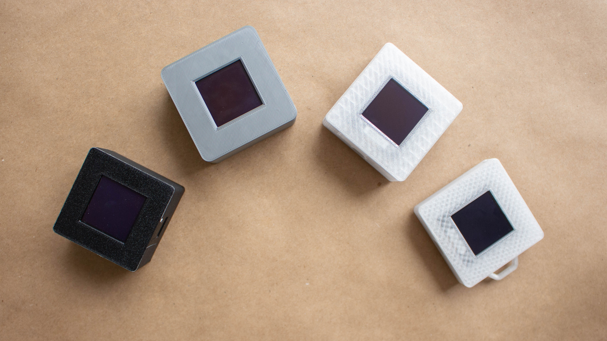

# TinkerPod

Open-Source | DIY | Multitool | Modular | Extendable

The TinkerPod is an Open-Source hardware platform designed to appeal to makers, creative coders,
and designers by providing a hackable and customizable hardware. Inspired by the evolution of
multitools and influenced by contemporary devices like the Flipper Zero and SQRT,
this project explores the application of critical making, and personal fabrication to Open-Source hardware.
The TinkerPod is an ideal hardware platform for designers and makers to explore, learn, modify and extend; make it your own!

## Versions

The TinkerPod was designed to have 3 versions. All the versions are currently supported.
The main difference between versions is the parts list, complexity of assembly and features.

- [v1 TinkerArt](v1/): This version offers generative art functionality and can be programmed to create unique art pieces.
- [v2 TinkerPlay](v2/): This version offers a variety of games and functions, including games like pong, a timer, an etch-a-sketch inspired drawing function
  and a generative art function out of the box.
- [v3 TinkerPod](v3/): This version is an enhanced version of v2, running the same firmware but with additional features like a vibratioin sensor,
  hardware debouncing for the buttons and a fully integrated PCB.

## Hardware

This project was designed to work around the QT PY RP2040 from Adafruit. Despite this, it is possible to run the TinkerPod with
other microcontrollers with the same pinout and form factor from other manufacturers. This includes other boards from
Adafruit (QT PY line), the XIAO boards from Seeed Studio, among others.

TinkerPod v1, does not include a PCB and can be wired without tools using a tiny solderless breadboard, the display, microcontroller, and the case.

For ease of assembly starting from V2, the Screen for the TinkerPod is a 1.5" grayscale OLED display with the SSD1327 controller using a STEMMA cable. This display can be found from Adafruit and
other manufacturers but the Adafruit version is recommended due to the STEMMA cable, that reduces complexity for the assembly.

The TinkerPod v2 and v3 include PCB designs and schematics and require soldering.
A detailed assembly guide can be found along side the version files.

The hardware for this project took inspiration from the following sources:

- [Adafruit Charger BFF for QT Py] (https://github.com/adafruit/Adafruit-Charger-BFF-PCB?tab=readme-ov-file#adafruit-charger-bff-for-qt-py-pcb)
- [Soldered Inkplate 2](https://github.com/SolderedElectronics/Soldered-Inkplate-2-hardware-design/tree/main)

## Firmware

All versions of the TinkerPod run on CircuitPython. The included firmware includes assets and base functionality.
You can modify the the firmware and add or change the functionality of the TinkerPod.

If you want to get started writing your own firmware and functionality, you can start with the [examples](examples/) directory.
This will provide the bassis for modifying the firmware and adding new functionality.

## Case

The case for the TinkerPod designed for 3D printing and can be printed using any FDM printer.
Printing settings are provided with each version files.

The cases for all versions were tested and printed using PLA and PETG. With the best results being
achieved with PETG on a textured plate.

Alternative cases can be found in the variants directory.

## Documentation

General guides can be found in the [docs](docs/) directory, including a simple guide to install CircuitPython and
managing the dependencies for the firmware.

## Acknowledgements

The hardware for this project took inspiration from the following sources:

- [Adafruit Charger BFF for QT Py] (https://github.com/adafruit/Adafruit-Charger-BFF-PCB)
- [Soldered Inkplate 2](https://github.com/SolderedElectronics/Soldered-Inkplate-2-hardware-design/tree/main)
- [SQRT](https://ksawerykomputery.com/works/sqrt)
- [Button debounce article](https://hackaday.com/2015/12/09/embed-with-elliot-debounce-your-noisy-buttons-part-i/)

## Contributions

Contributions are welcome and appreciated. If you have any suggestions or improvements, please feel free to open an issue or submit a pull request.

## License

The TinkerPod firmware is licensed under the MIT License. See the [LICENSE](LICENSE) file for details.
// Add hardware license for the the other files
// Add copyright for the other files
