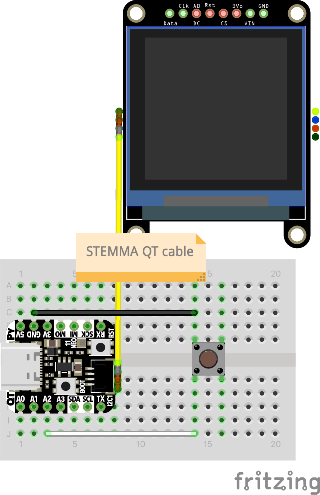

# Draw Example

For this example, you can use the tinker pod v2 or v3 PCB or the breadboard option from v1.

## Parts

| Part                       | Quantity |
| -------------------------- | -------- |
| Adafruit QT PY RP2040      | 1        |
| 1.5" Gray scale OLED       | 1        |
| STEMMA QT/Qwiic cable      | 1        |
| Tiny breadboard (Optional) | 1        |

## Schematic

Gently connect the STEMMA QT/Qwiic cable to the Adafruit QT PY RP2040 and the 1.5" Gray scale OLED.

> Optionally you can follow the wiring diagram from v1 to use a waveshare screen.

## Flashing CircuitPython

If you have not already installed CircuitPython, follow the guide found [here](/docs/install-circuitpython.md)

## Dependencies

Ensure this dependencies are present in the `lib` folder on the microcontroller:

- Adafruit CircuitPython firmware for the supported boards:
  https://github.com/adafruit/circuitpython/releases
- Adafruit CircuitPython SSD1327 driver:
  https://github.com/adafruit/Adafruit_CircuitPython_SSD1327

A tutorial for installing dependencies can be found [here](/docs/install-dependencies.md)

## Running the example

To run the example, follow these steps:

1. Connect the microcontroller to a computer using a USB-C cable.
2. Copye the `code.py` file from this folder to the `CIRCUITPY` drive.
3. The QT PY should soft reboot and run the code.
