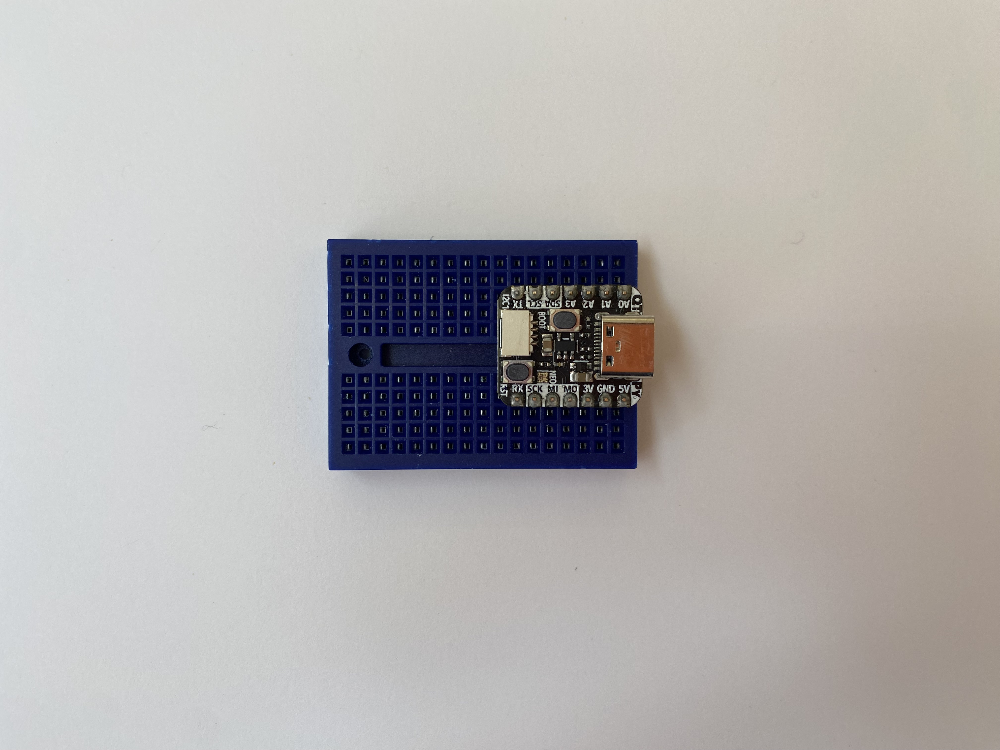
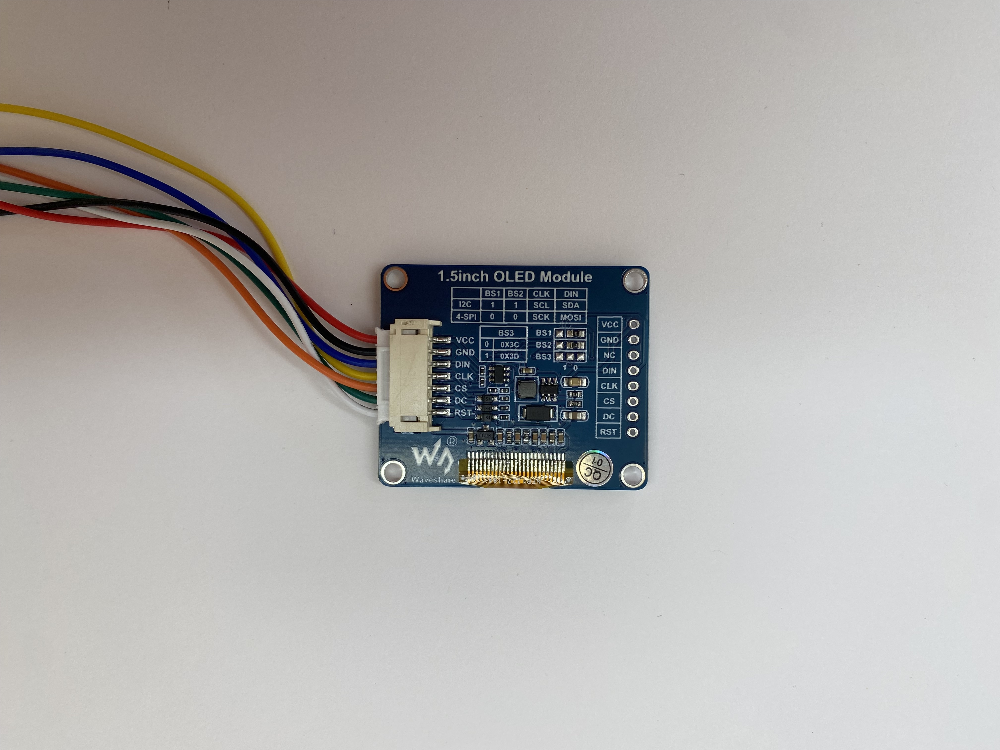
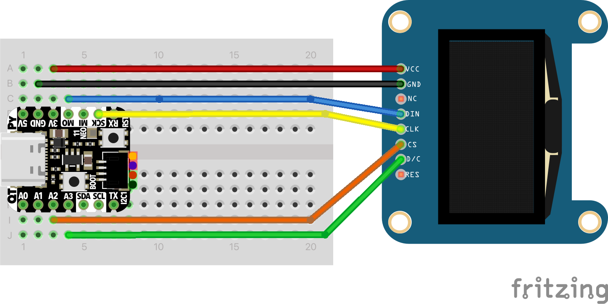
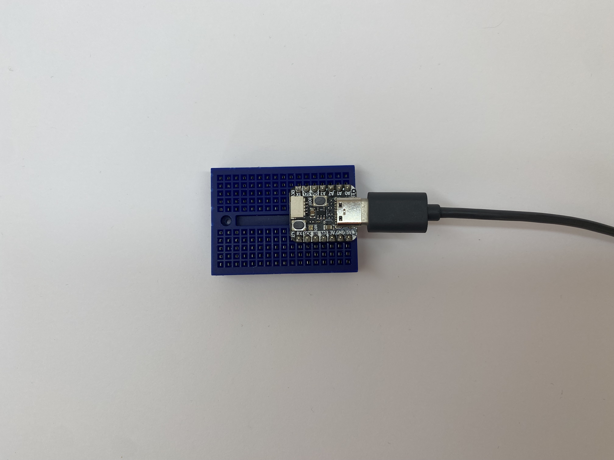
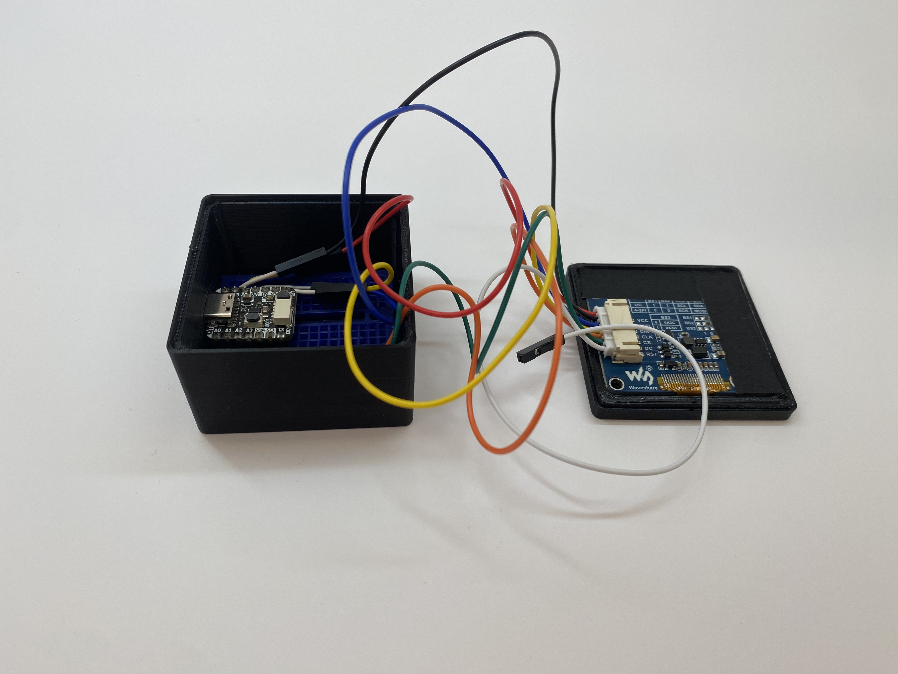
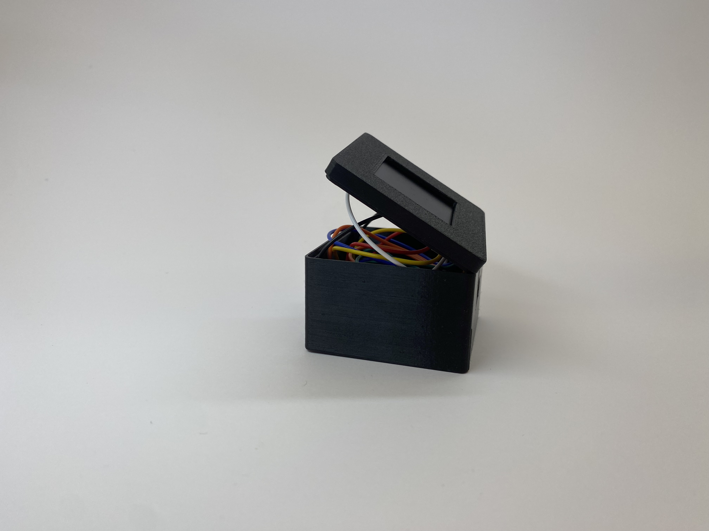
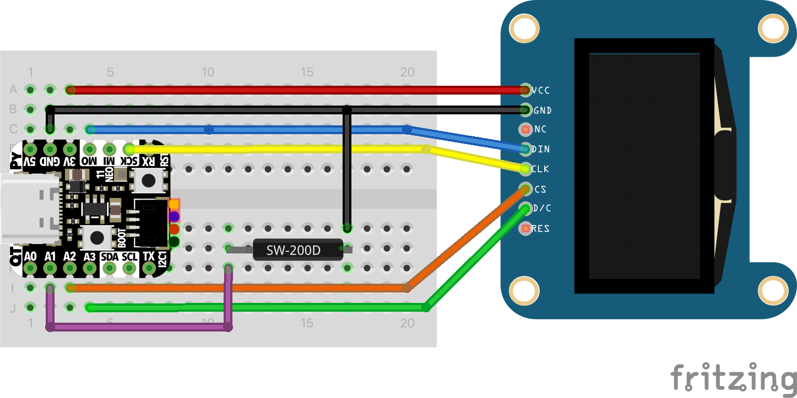

# Tinkerpod v1

The TinkerPod v1 is the simplest version of the family. It is designed to be a basic introduction to the TinkerPod ecosystem.

## Part list

| Part                  | Quantity |
| --------------------- | -------- |
| Adafruit QT PY RP2040 | 1        |
| 1.5" Gray scale OLED  | 1        |
| Tiny breadboard       | 1        |
| Jumper wires          | 5        |

## 3D Printed Case

This version was tested with PLA and PETG.
The suggested orientation of the two parts is with the flat surfaces facing the build plate.
The print was made without supports with the following params:

| Param        | Value |
| ------------ | ----- |
| Layer height | 0.2mm |
| Nozzle       | 0.4mm |
| Infill       | 20%   |

The STL files can be found in the [`case/`](case/) directory.

## Firmware

The current firmware consists of the screen setup and a generative art demo.
The firmware is written in CircuitPython and works
by coping the content of the [`firmware`](firmware/) directory to the microcontroller.

### Dependencies

The firmware depends on the following libraries:

- [Adafruit CircuitPython SSD1327 driver](https://github.com/adafruit/Adafruit_CircuitPython_SSD1327)

More information about this library can be found in the official [docs](https://docs.circuitpython.org/projects/ssd1327/en/latest/)

## Assembly

1. Flash circuit python on the QT PY RP2040.
   1. Open the official [site](https://circuitpython.org/board/adafruit_qtpy_rp2040/) and download the latest version of circuit python.
   2. While holding the _boot_ button in the QT PY, plug it into a computer using the USB-C cable. Different version of the QT PY might need a different button to access bootloader mode, please check the official [docs](https://learn.adafruit.com/welcome-to-circuitpython/installing-circuitpython) for the specific board.
   3. The device should appears mounted in the OS as **RPI-RP2**, this might be different for other boards other than the RP2040 board.
   4. Drag and drop the `.UF2` file (downloaded in step 1) to the `RPI-RP2` boot drive.
   5. After a couple of seconds the onboard neopixel (LED) will flash and a new drive will appear in the computer, this time it should be called **CIRCUITPY**.
   6. ⚠️ Always eject the device before unplugging the cable.
   7. The device is ready to be installed.
2. Solder the pins to the QT PY.
3. Place the pins in the microcontroller and carefully place both on the breadboard.
4. Solder the pins to the microcontroller.
5. Place the microcontroller in the the breadboard.
   
6. Connect the screen cable to the screen socket.
   
7. Wire the screen cables following this diagram:
   
8. Plug the USB C cable to the micro controller.
   
9. A new device should show up in your file system. Usually the device will be called `CIRCUITPY`
10. Download the [firmware/](firmware/) directory for this version.
11. Copy all the files from the `firmware/` directory (`code.py` and `lib/`) to the `CIRCUITPY` drive.
12. The device will restart and generative art function should start.
13. Place the screen in the top part of the case.
14. Place the breadboard in the bottom part of the case.
    
15. Close the case with some tape.
    

> ⚠️ Do not unplug the device from your computer without ejecting it properly.

## Official mods

### Add interaction with a vibration sensor

To add the same vibration sensor from version 2 to the TinkerPod v1.

Follow this schematic:



And update the `code.py` file to use the sensor following the [button example](/examples/button).

For example:

```python
# code.py in firmware

# create the digital input for the vibration sensor on Pin A1
shake = digitalio.DigitalInOut(board.A1)
shake.direction = digitalio.Direction.INPUT
# enable pull up resistor
shake.pull = digitalio.Pull.UP

# store the shake state
was_shaken = False

while(True):
	# read the shake sensor as any other button
	if not shake.value:
		# store the shake state
		was_shaken = True

	# if the device was shaken
	if was_shaken:
		# get a random quadrant
		i = random.randint(0, 15);
		# clear the space on the screen
		clear_quadrant(i)
		# get a random draw function
		fn = random.choice(fns)
		# draw the function on the screen
		fn(i)
		# clear the shaken state
		was_shaken = False
		# wait for 0.3 seconds
		time.sleep(0.3)
```

Now the tinkerpod will react to a shake by updating the screen.
